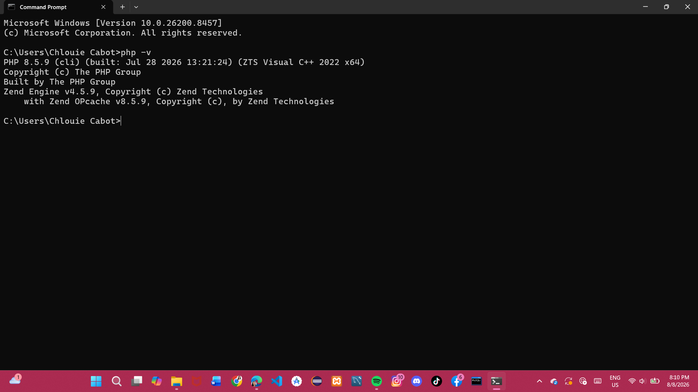
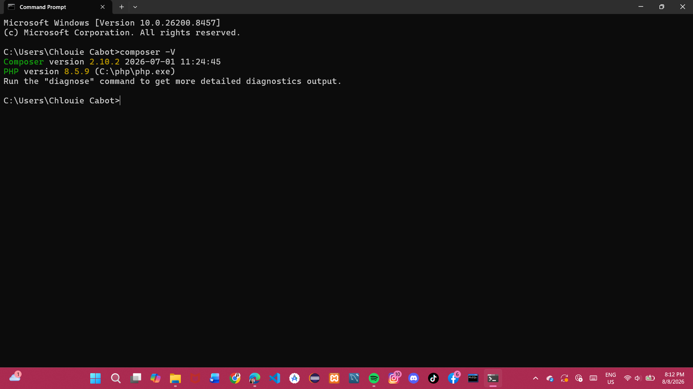

Hello Laravel

---

## 1. Project Title

**Hello Laravel** — Week 02 Activity for ITST 302: Client-Server Technologies

---

## 2. Introduction

### Brief Overview of Laravel
Laravel is a free, open-source PHP web framework designed for building modern web applications. It follows the Model-View-Controller (MVC) architectural pattern and provides an expressive, elegant syntax that makes web development enjoyable. Laravel comes with built-in tools for routing, authentication, database management, and templating through its Blade engine.

### Importance of Client-Server Technologies
Client-Server Technologies form the backbone of modern web development. Understanding how a client (browser) communicates with a server (backend application) is essential for any software developer. Laravel serves as the server-side framework that handles requests, processes logic, and returns responses to the client — making it a perfect tool for learning this architecture.

### Purpose of the Project
The purpose of this project is to set up a Laravel application from scratch, configure the development environment, and display a personalized homepage. This activity serves as a hands-on introduction to Laravel's structure, routing system, and Blade templating engine.

---

## 3. Objectives

By completing this activity, the following objectives were achieved:

1. Successfully installed and configured PHP, Composer, and Laravel on a Windows machine.
2. Created a new Laravel project using the Composer `create-project` command.
3. Configured the `.env` file and generated an application key using `php artisan key:generate`.
4. Customized the homepage route in `routes/web.php` to return a Blade view.
5. Designed a styled welcome page using Blade templating and CSS with developer information.
6. Initialized a Git repository and maintained a meaningful commit history following professional conventions.
7. Published the project to a public GitHub repository for submission.

---

## 4. Development Environment

| Tool             | Version / Details                  |
|------------------|------------------------------------|
| Operating System | Windows 11                         |
| PHP              | 8.5.9                              |
| Laravel          | 13.24.0                            |
| Composer         | 2.10.2                             |
| Git              | 2.51.1 (windows)                   |
| MySQL            | 8.0.44 (Community Server)          |
| VS Code          | Latest Stable                      |

---

## 5. Installation Steps

### Step 1 — Install PHP
Download PHP from [https://windows.php.net/download](https://windows.php.net/download) and extract it to `C:\php`. Add `C:\php` to your system's PATH environment variable.

Verify installation:
```bash
php --version
```

> 📸 *Screenshot: PHP version output in terminal*

---

### Step 2 — Install Composer
Download and run the Composer installer from [https://getcomposer.org](https://getcomposer.org). The installer will automatically detect PHP and add Composer to PATH.

Verify installation:
```bash
composer --version
```

> 📸 *Screenshot: Composer version output in terminal*

---

### Step 3 — Create a Laravel Project
```bash
composer create-project laravel/laravel hello-laravel
cd hello-laravel
```

> 📸 *Screenshot: Laravel project creation in terminal*

---

### Step 4 — Configure the .env File
```bash
copy .env.example .env
php artisan key:generate
```

> 📸 *Screenshot: APP_KEY generated successfully*

---

### Step 5 — Run the Development Server
```bash
php artisan serve
```

Open your browser and go to `http://localhost:8000`.

> 📸 *Screenshot: Laravel welcome page running in browser*

---

### Step 6 — Customize the Homepage
Edit `routes/web.php`:
```php
Route::get('/', function () {
    return view('welcome');
});
```

Edit `resources/views/welcome.blade.php` with your personal information and styling.

> 📸 *Screenshot: Customized homepage in browser*

---

### Step 7 — Push to GitHub
```bash
git init
git add .
git commit -m "feat: initialize Laravel project"
git remote add origin https://github.com/<your-username>/<repo-name>.git
git push -u origin main
```

> 📸 *Screenshot: GitHub repository with commit history*

---

## 6. Project Structure

```
hello-laravel/
├── app/
├── routes/
├── resources/
├── public/
├── config/
├── database/
├── .env
└── README.md
```

| Folder / File     | Purpose                                                                 |
|-------------------|-------------------------------------------------------------------------|
| `app/`            | Contains the core application logic including Models, Controllers, and Middleware. This is where most of the backend business logic lives. |
| `routes/`         | Defines all URL routes for the application. `web.php` handles browser routes while `api.php` handles API endpoints. |
| `resources/`      | Holds Blade view templates, raw CSS/JS assets, and language files. The `views/` subfolder contains all HTML templates. |
| `public/`         | The web server's document root. Contains `index.php` (the entry point) and compiled assets like CSS and JS. |
| `config/`         | Stores all configuration files for the application such as database, mail, cache, and session settings. |
| `database/`       | Contains database migrations, seeders, and factories used to define and populate database tables. |

---

## 7. Problems Encountered

### Problem 1 — Composer Not Recognized
After installing Composer, running `composer` in the terminal returned `'composer' is not recognized as an internal or external command`. This happened because the Composer executable was not added to the system PATH.

### Problem 2 — PHP PATH Issue
PHP was installed but the terminal could not find it. Running `php --version` returned an error because `C:\php` was not included in the Windows environment variables PATH.

### Problem 3 — Missing .env File
After cloning or setting up the project, Laravel returned a server error on the browser. The cause was a missing `.env` file — Laravel requires this file to load environment configuration including the `APP_KEY`.

### Problem 4 — MySQL Service Not Starting
MySQL failed to start through XAMPP's control panel. The port 3306 was already in use by another process, preventing the MySQL service from binding to the port.

---

## 8. Solutions

### Solution 1 — Composer Not Recognized
Opened **System Properties → Environment Variables → Path** and manually added the path to the Composer executable (`C:\Users\<username>\AppData\Roaming\Composer\vendor\bin`). Restarted the terminal and the command worked.

### Solution 2 — PHP PATH Issue
Added `C:\php` to the system PATH environment variable through **Control Panel → System → Advanced System Settings → Environment Variables**. After restarting the terminal, `php --version` returned the correct version.

### Solution 3 — Missing .env File
Ran the following commands to create the `.env` file and generate the application key:
```bash
copy .env.example .env
php artisan key:generate
```
This resolved the server error and Laravel loaded successfully.

### Solution 4 — MySQL Service Not Starting
Opened **Task Manager → Services** and stopped the process occupying port 3306. Alternatively, changed the MySQL port in XAMPP's `my.ini` configuration file to `3307`. After the change, MySQL started successfully.

---

## 9. Screenshots

> Add your screenshots inside the `screenshots/` folder and reference them below.

| Screenshot | Caption |
|------------|---------|
|  | PHP 8.5.9 version confirmed in terminal |
|  | Composer 2.10.2 version confirmed in terminal |
|  | Laravel project created via Composer |
|  | Application key generated successfully |
|  | Customized homepage running at localhost:8000 |
|  | GitHub repository with 5+ commits |

---

## 10. Reflection

Setting up Laravel for the first time was both challenging and rewarding. Before this activity, I had a basic understanding of PHP, but I had never worked with a full framework before. Going through the installation process step by step gave me a much deeper appreciation for how modern web applications are structured and how the different components work together.

One of the most important things I learned is how Laravel follows the Model-View-Controller (MVC) pattern. This separation of concerns — where the model handles data, the view handles presentation, and the controller handles logic — makes applications much easier to maintain and scale. Understanding this pattern early on will be incredibly useful as I work on more complex projects in the future.

The challenges I encountered, particularly with environment variables and the missing `.env` file, taught me the importance of proper configuration management. In real-world development, misconfigured environments are one of the most common sources of bugs and deployment failures. Learning how to troubleshoot these issues now means I will be better prepared when I encounter similar problems in professional settings.

Laravel's routing system also impressed me. Being able to define a URL and immediately connect it to a view or controller with just one line of code in `web.php` is incredibly efficient. Compared to writing raw PHP where you would have to manually parse URLs and include files, Laravel's approach is clean, readable, and professional.

Why is Laravel important in client-server development? Laravel acts as the server-side layer that receives HTTP requests from the client (browser), processes them, interacts with the database if needed, and returns a response. This is the fundamental cycle of client-server communication, and Laravel makes this process structured and secure. Features like CSRF protection, input validation, and Eloquent ORM are built in, which means developers can focus on building features rather than reinventing security mechanisms.

Looking ahead, the knowledge I gained from this activity will serve as a strong foundation for future software development projects. Whether I am building a REST API, a full-stack web application, or a database-driven system, the concepts I learned here — routing, templating, environment configuration, and version control — are universal skills that apply across many technologies and frameworks. I am excited to continue building on this foundation throughout the course.

---

## 11. References

Laravel. (2024). *Laravel documentation*. https://laravel.com/docs

PHP Group. (2024). *PHP manual*. https://www.php.net/manual/en/

Composer. (2024). *Composer documentation: Dependency manager for PHP*. https://getcomposer.org/doc/

Git. (2024). *Git reference manual*. https://git-scm.com/docs

MySQL. (2024). *MySQL 8.0 reference manual*. https://dev.mysql.com/doc/refman/8.0/en/

Otwell, T. (2024). *Laravel: The PHP framework for web artisans*. https://laravel.com

---

*© 2026 Chlouie Cabot — ITST 302 Client-Server Technologies, BSIT 3C*
